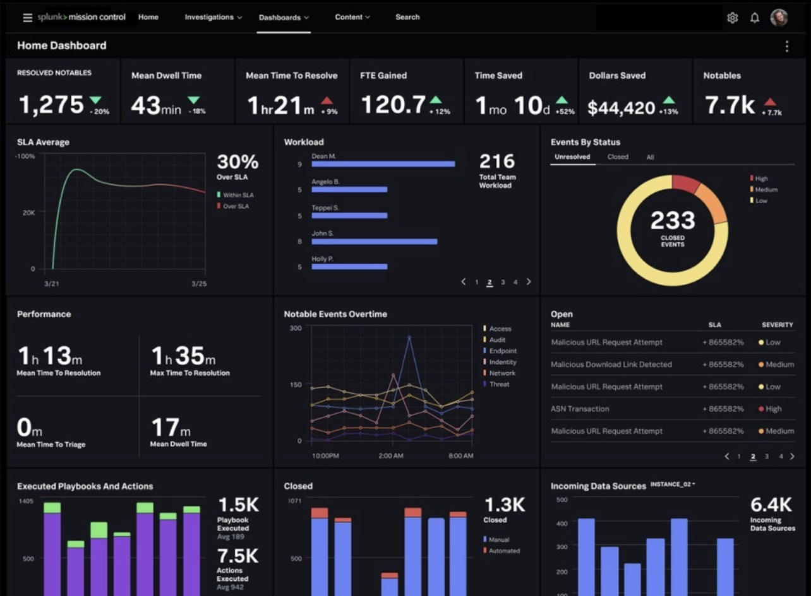
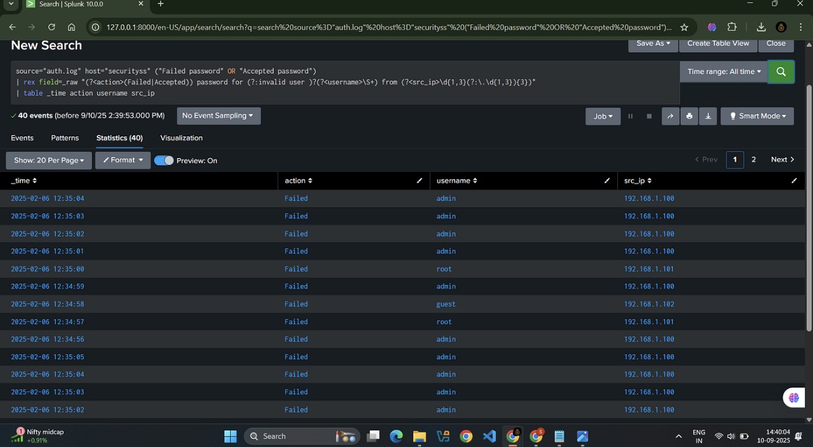
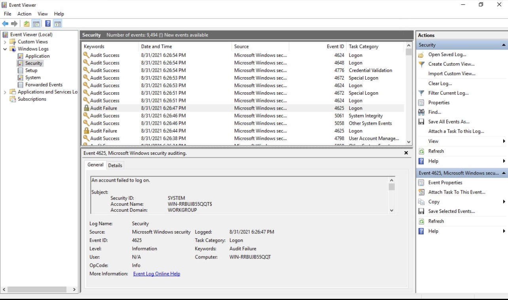
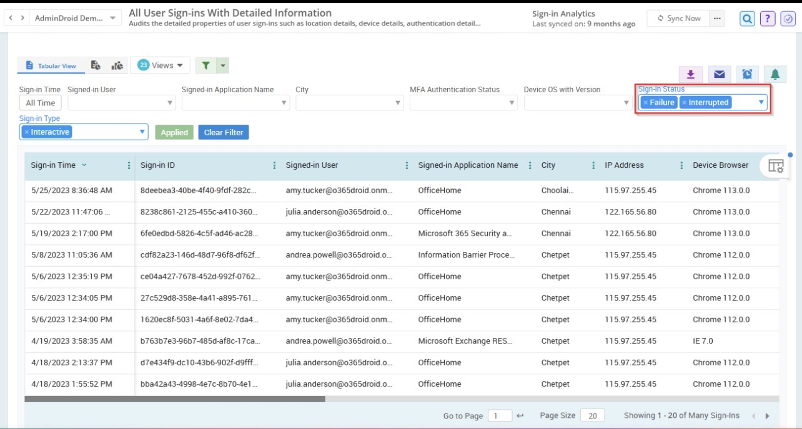

# SIEM Log Analysis (SOC Project)

## 📌 Objective
To analyze security logs using SIEM tools and detect suspicious activities.

## 🛠 Tools Used
- Splunk (SIEM)
- Sample Log Data

## 🔍 Use Case
Analyzed logs to identify:
- Multiple failed login attempts
- Suspicious IP activity

## 🚨 Findings
- Detected brute force attack pattern
- Identified repeated login failures from same IP

## 📷 Screenshots

## 📚 Conclusion
This project demonstrates basic SOC analyst skills like log monitoring, alert detection, and incident analysis.
